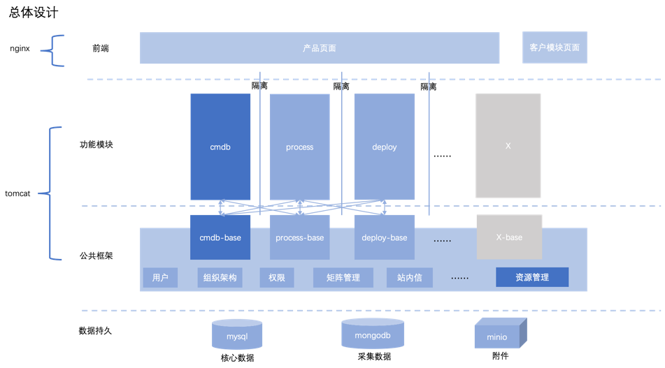

中文 / [English](README.en.md)


---

## 关于

neatlogic-framework是整个项目的底层框架，所有模块均需要引用neatlogic-framework。

## 模块化

neatlogic基于Spring MVC，版本5.x。通过动态加载Servlet，利用SpringContext分层特性实现模块化管理。\
如下图所示，子模块之间的bean互不影响，不能相互织入，公共模块的bean可以织入子模块的bean中。\


* root context通过ContextLoaderListener加载，管理公共的bean。
* module context通过DispatcherServlet加载，管理模块内部的bean。
* 通过ModuleInitializer动态创建DispatcherServlet。
* 模块之间调用通过@RootComponent，作为粘合剂（工厂模式、模板类模式）。

做二次开发时，开发者需要把类放进不同的包中，以决定这个类所创建的bean是否成为公共模块的一部分。\
neatlogic的每个子模块都会分成两个工程：neatlogic-xxx和neatlogic-xxx-base（如果此模块的bean不会被其他子模块引用，neatlogic-xxx-base可不创建。）
neatlogic-xxx中的包路径从neatlogic.module.xxx开始，这里的类变成bean后只能在xxx模块中使用。\
neatlogic-xxx-base中的包路径从neatlogic.framework.xxx开始，这里的类变成bean后，可以被除neatlogic-framework以外的所有子模块bean引用。
而pojo类，例如dto类，枚举类等，我们建议放在neatlogic-xxx-base工程中管理。

这个规则是由root-content.xml和xxx-servlet-context.xml共同决定的。

## 多租户

neatlogic采用中间件共享，数据库独占的多租户模式。

### 核心类

- NeatLogicRoutingDataSource：通过threadlocal中的租户信息分发真正的datasource。
- NeatLogicBasicDataSource：继承HikariDataSource，系统真正使用的datasource，可以在返回connection之前做一些前置操作，例如更改session配置。

## 处理流程

neatlogic采用前后端分离架构，后端服务全部以restful接口形式暴露出去供前端调用。入口类是ApiDispatcher，支持三种数据格式，分别是json，json流和文件。不同的数据格式需要继承不同的基础类。\

为了提高复用性和方便管理，neatlogic的每一个接口都是一个独立的bean，接口类可根据实际需要继承ApiComponentBase、JsonStreamApiComponentBase、BinaryStreamApiComponentBase三个基础类。\
在每个接口类中可以通过注解定义接口的访问权限、操作类型（审计用）、入参、出参、说明、数据范例等信息，可以根据这些配置一键导出所有接口文档。

## 多活机制

neatlogic的部署方式是多活架构，自带简易的心跳机制让每个服务实例之间能彼此了解存活情况，从而完成某些特殊的漂移工作，例如让定时作业服务自动漂移。

### 心跳机制

- 每个服务实例都有一个唯一服务实例id，服务第一次启动时会自动生成，生成后会保存在serverid.conf中，后面作为当前服务的唯一标识。
- 考虑企业内部可能有防火墙，心跳状态利用数据库进行传递，服务实例之间不会互发心跳。
- 通过心跳计数器来判断服务实例存活状态。

### 心跳算法

1. 服务实例启动时把状态写入状态表（neatlogic库server_status表），将自身状态设为startup。并且启动一个心跳线程定时执行心跳检测。
2. 每次心跳唤醒时，先清空自身计数器，并且给自己的关注服务实例计数器+1，如果关注服务实例的计数器已经大于某个阈值，则将它的状态设为shutdown。
3. 调用漂移接口下所有实现类，完成漂移动作。所有需要在服务实例死亡时需要处理的逻辑，都需要实现IHeartbreakHandler接口。

关注服务实例：服务实例id大于自己，并且状态是startup的服务实例，如果没有更大的服务实例id，则寻找最小的服务实例id，最后形成一个监控环。\
心跳频率通过设置heartbeat.rate参数控制，单位是分钟，失败阈值通过heartbeat.threshold控制。

### 多线程

由于neatlogic通过threadlocal中的租户信息切换数据源，所以不能直接定义thread来实现异步作业，所有线程都需要继承NeatLogicThread来创建。

NeatLogicThread会在实例化阶段自动获取当前线程的threadlocal信息，保证异步线程和线程能使用同一个数据源进行工作。
NeatLogicThead也会等待所有模块全部加载完毕才会开始执行，避免启动过程中抢先执行导致异常。

使用范例：

``` java
CachedThreadPool.execute(new NeatLogicThread() {
    @Override
    protected void execute() {
        //do something
    }
});
```

CachedThreadPool是框架中的线程池，可以直接使用，**不要自己创建线程池**。
**考虑到CachedThreadPool会被多处引用和避免不同租户之间有明显的资源竞争关系，
CachedThreadPool是个无限线程池，使用前一定要注意控制线程数量和考虑每个线程作业的执行时间，不能引起系统OOM。**

## 定时调度

统一使用SchedulerManager进行定时调度管理，包括内部作业和外部作业。

使用范例：

``` java
JobObject.Builder newJobObjectBuilder = new JobObject.Builder(changeId.toString(), this.getGroupName(), this.getClassName(), TenantContext.get().getTenantUuid()).withBeginTime(changeAutoStartVo.getTargetTime()).withIntervalInSeconds(60 * 60).withRepeatCount(0).addData("changeId", changeId);
JobObject newJobObject = newJobObjectBuilder.build();
schedulerManager.loadJob(newJobObject);
```

SchedulerManager启动时会加载所有租户的定时作业并运行。配合HeartbeatManager可以实现定时作业自动飘移。

- 内部作业：由系统自己发起作业，不允许用户自由配置，需要实现IJob接口。
- 外部作业：由用户在作业管理中配置发起，支持多个作业实例，需要实现IPublicJob接口。

## 全文检索

由于不想单独维护一套ES环境，并且没有找到理想方案解决ES数据和DB数据联动问题，因此neatlogic的全文检索会把分词结果存放在数据库里，通过SQL查询实现全文检索功能。

系统会自动根据FullTextIndexInitializer中定义的document种类自动创建相关数据表。只需要实现FullTextIndexHandlerBase中的相关方法，系统会把索引数据自动写入对应的数据表，查询时也不需要关注数据表具体的名称，只需要写前缀，系统会通过FulltextIndexInterceptor在SQL执行前替换成正确的数据表来执行。

